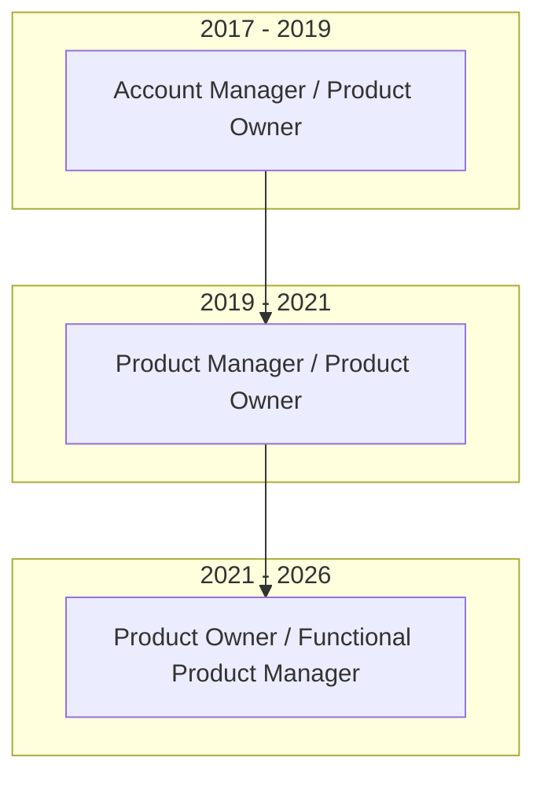

# Master Career Context Spec (v3.1)

```yaml
document_type: master_career_context_spec
primary_objective: preserve_ground_truth_career_history_and_prevent_hallucinations
intended_reader: ai_resume_and_cover_letter_generation_agent
human_readable: true
inputs:
  - user_work_history_logs
  - platform_architectural_maps
  - corporate_metrics_records
output:
  - verified_source_of_truth_context
optimization_order:
  - absolute_truthfulness
  - factual_grounding
  - metric_integrity
  - precise_plain_language_positioning
forbidden_behaviors:
  - inventing_revenue_or_retention_metrics
  - claiming_people_management_or_direct_reports
  - claiming_model_training_or_ai_engineering
  - using_internal_company_codenames
  - fabricating_customer_satisfaction_data
```

## Section 1: Role Identity & Positioning

Jason Taylor is a **B2B SaaS Platform Product Manager** with 6+ years of experience in technically complex, revenue-bearing environments. He operates close to engineering, infrastructure, and system architecture, but his focus is always on business outcomes—stabilizing platforms under resource constraints, reducing major churn drivers, enabling voluntary migrations, and aligning cross-functional teams.

### 1.1 Core Specialization Areas
*   **Platform Stabilization & Reliability**: Managing legacy components, resolving systemic outage patterns, and mitigating infrastructure risk.
*   **Data Integrity & Ingestion Systems**: Redesigning data pathways, resolving ingest drop-offs, and consolidating content feeds.
*   **Migration Strategy & Sunset Planning**: Structuring voluntary, value-driven transition programs to protect revenue during platform sunsets.
*   **Disciplined Prioritization under Constraint**: Capacity modeling, scope control, and security backlog triage amid layoffs and organizational shifts.
*   **Cross-Functional Alignment**: Building trust with engineering managers, database administrators, DevOps, legal, customer experience, and sales.

### 1.2 Target Role Level & Positioning
*   **Target Role**: Mid-level Product Manager / PM II (IC Role) with 3–7 years of experience.
*   **Structured Mentorship Fit**: Optimized to grow under direct PM leadership (e.g., reporting to a Director of Product or Senior PM) within a larger structured product organization.
*   **Pragmatic Problem Solver**: Positioned as a hands-on, highly literate platform PM who thrives inside legacy complexity and imperfect data environments.

### 1.3 Exclusion Zones (What He is NOT)
*   **NOT a 0-to-1 Greenfield PM**: Does not specialize in initial consumer UX innovation or launching unproven products.
*   **NOT an AI/ML Product Lead**: Has not built, trained, or owned machine learning or predictive models.
*   **NOT a People Manager**: Has never hired, fired, or formally managed other Product Managers or engineers.
*   **NOT a Revenue/Billing Owner**: Has never owned billing, invoicing, payments, or direct revenue-generating pricing systems.

---

## Section 2: Career Chronology & Reporting



### 2.1 Employer Timeline Details
| Employer | Role | Start Date | End Date | Reporting Line | Team Footprint |
| :--- | :--- | :--- | :--- | :--- | :--- |
| **Cision** | Product Owner (Functionally Product Manager) | September 2021 | January 2026 | Reported to Director of Product (first 3 months), then operated autonomously partnering with Engineering Managers. | Fluctuated between 6 and 15 engineers across up to 3 cross-functional teams (including Core, Next-Gen Core B2B SaaS Platform, and Migration Tooling). |
| **Sterkly Services** | Product Manager / Product Owner | February 2019 | August 2021 | Reported to Head of Product / Operations. | Partnered with 1 cross-functional team of 5-8 engineers and QA. |
| **Zero To Sixty Media** | Account Manager / Product Owner | June 2017 | January 2019 | Reported to Account & Operations Director. | Partnered with 2-3 developers and external vendor teams. |

---

## Section 3: Approved Plain-Language Vocabulary Translation Map

To eliminate technical obscurity and prevent ATS parsing failure, all company-specific internal codenames MUST be systematically translated into high-impact, plain-language business equivalents using this master map:

| Fact ID | Internal Codename | Plain-Language / Business Equivalent | Context & Purpose |
| :--- | :--- | :--- | :--- |
| **VOC-01** | **Platform Data Remediation** | Centralized platform data remediation initiative | Jason's signature architectural bypass project that directly linked Centralized Contact Database to Core B2B SaaS Platform, eliminating stale data complaints. |
| **VOC-02** | **Core B2B SaaS Platform** | Customer-facing B2B SaaS media monitoring & contact database platform | The primary revenue-bearing legacy platform Jason managed ($40M ARR, 25,000 active users). |
| **VOC-03** | **Core Platform Infrastructure** | Underlying core infrastructure and shared platform layer | The core technical foundation that supported Core B2B SaaS Platform and handled shared data services. |
| **VOC-04** | **Centralized Contact Database** | Centralized contact source-of-truth database | The upstream master database of journalists and outlets (not owned by Jason; consumed via Platform Data Remediation). |
| **VOC-05** | **Upstream Media Monitoring Platform (Upstream Media Monitoring Platform)** | Upstream enterprise content monitoring system | The corporate-wide master media monitoring ingest platform (not owned by Jason; consumed via Media Monitoring Ingestion Platform). |
| **VOC-06** | **Media Monitoring Ingestion Platform** | Core monitoring ingestion platform | The Core B2B SaaS Platform-specific content consumption platform owned and maintained by Jason to process data from Upstream Media Monitoring Platform. |
| **VOC-07** | **Nexus / EDP** | Unified enterprise shared data architecture | The new shared data initiative meant to unify data across products (not owned by Jason; integrated with directionally). |
| **VOC-08** | **Critical Save Program** | High-risk account retention program | The proactive retention effort focused on migrating vulnerable accounts likely to churn. |
| **VOC-09** | **White Glove Accounts** | Premium high-revenue enterprise clients | Enterprise accounts receiving prioritized, custom triage and escalation paths. |
| **VOC-10** | **Premium Content Initiative** | Compliance-gated third-party content integration | An executive-led effort to integrate premium sources (NYT, Bloomberg, Factiva) with strict retention workflows. |
| **VOC-11** | **DT Search** | Platform content indexing engine | The technical search component used to index customer news database tables. |

---

## Section 4: Rigorous Ground-Truth Metrics Matrix

These metrics are the **absolute bounds of truth**. They must never be extrapolated, inflated, or modified under any circumstances:

| Fact ID | Metric Category | Verified Value | Ground-Truth Scope & Meaning |
| :--- | :--- | :--- | :--- |
| **MET-01** | **core customer-facing B2B SaaS platform Revenue** | **$40,000,000 ARR** (approximate) | Total annual recurring revenue tied to the customer-facing legacy platform during Jason's tenure. |
| **MET-02** | **Customer Scale** | **~3,500 active accounts** | Total paying businesses and enterprise clients supported on the legacy platform. |
| **MET-03** | **User Scale** | **~25,000 active users** | Total daily/weekly active individual professional users accessing the platform. |
| **MET-04** | **Platform Churn Rate** | **7% annually** (approximate) | Extremely stable retention rate, including voluntary migrations to newer corporate systems. |
| **MET-05** | **Infrastructure Savings** | **$1,000,000 - $2,000,000** | Cumulative cost reduction achieved through resources optimization and dead account cleanups. |
| **MET-06** | **Contact Data Loss** | **30% - 40% loss** (pre-remediation) | Historical data drop-off rate between Centralized Contact Database and Core B2B SaaS Platform due to layered legacy ETL pipelines. |
| **MET-07** | **Data Drop-off Resolved** | **100% reduction** | Total elimination of stale-contact complaints tied to the data pipeline post-Platform Data Remediation launch. |
| **MET-08** | **Security Risk Backlog** | **90% resolved** (approximate) | Resolution of high-priority security vulnerabilities from an initial backlog of ~300 items. |
| **MET-09** | **Customer Databases** | **~200 SQL databases** | The physical database footprint managed and maintained under Core Platform Infrastructure. |
| **MET-10** | **Voluntary Migrations** | **~700 accounts** (approximate) | Total successful, non-disruptive migrations completed using the custom phased tooling. |
| **MET-11** | **Fulfillment Automation** | **$288,000 in contracts** | Total laptop vendor contract value managed, saving **$8,500 per quarter** ($34,000/yr) via automation. |
| **MET-12** | **Onboarding Automation** | **$22,100 saved annually** | Total cost savings from an internal automation project that streamlined user onboarding into Salesforce. |

---

## Section 5: Role-by-Role Deep Dive Specifications

### 5.1 Cision (September 2021 - January 2026)
*   **Context & Constraints**: Legacy $40M ARR platform slated for sunset, operating under shrinking engineering headcount, repeated layoffs (3-4 cycles), executive turnover (3 management teams), and a complete lack of dedicated customer support resources.
*   **Owned Systems**: Customer-facing B2B SaaS media monitoring & contact database platform (Core B2B SaaS Platform) and underlying core infrastructure layer (Core Platform Infrastructure).
*   **Unowned Systems**: Centralized contact source-of-truth database (Centralized Contact Database), upstream enterprise content monitoring system (Upstream Media Monitoring Platform), and Cision One next-gen platforms.

#### Approved Accomplishments Inventory
*   **[ACC-101] Platform Stabilization**: Mitigated recurring indexing server crashes by implementing proactive storage capacity monitoring, alerting thresholds, and legal-approved cleanups of stale accounts, reducing overall service outages.
*   **[ACC-102] Data Remediation**: Conceived and drove a centralized platform data remediation initiative that bypassed failing legacy ETL paths to integrate directly with the upstream source-of-truth database, eliminating a 30-40% data drop-off rate and reducing stale-data complaints to zero.
*   **[ACC-103] Security Backlog Triage**: Prioritized a massive backlog of ~300 penetration test vulnerabilities using a balanced, risk-weighted severity scoring filter, resolving 90% of security risks over a one-year phased roll-out without stalling core roadmap development.
*   **[ACC-104] Controlled Migration Strategy**: Partnered with upgrades, engineering, and customer experience teams to build and deploy phased voluntary migration tooling, successfully transitioning ~700 high-risk accounts at renewal times without customer friction.
*   **[ACC-105] Prioritization & Capacity Discipline**: Replaced reactive planning with a rigorous, PTO-adjusted capacity model based on workday-hours per engineer, using T-shirt sizing with uncertainty bands to manage resource allocations across stability, compliance, and planned roadmap items.

#### Factual Anti-Claims & Boundaries (DO NOT CLAIM)
*   *DO NOT claim Core B2B SaaS Platform returned to revenue growth (it was intentionally winding down).*
*   *DO NOT claim that any specific dollar amount of revenue was retained directly due to Platform Data Remediation.*
*   *DO NOT claim that the Kafka pipeline migration or CI/CD modernization was fully completed (they were scoped/initiated but not finalized).*
*   *DO NOT claim direct management or hiring of engineering team members.*
*   *DO NOT claim ownership of the company's premium content strategy or licensing contracts.*

---

### 5.2 Sterkly Services (February 2019 - August 2021)
*   **Context & Constraints**: Fast-paced professional services and digital workflow environment requiring rigorous requirements translation and stakeholder alignment to keep product delivery moving under tight timelines.
*   **Owned Systems**: Internal workflows, project requirements, and operational product delivery tools.

#### Approved Accomplishments Inventory
*   **[ACC-201] Operational Bottleneck Reduction**: Analyzed and optimized internal team workflows by standardizing requirements gathering, resolving resource conflicts, and facilitating regular cross-functional alignment sessions to maintain consistent delivery.
*   **[ACC-202] Technical-Business Translation**: Translated complex business constraints and operational requirements into granular, engineering-ready product specs, partnering with a team of 5-8 developers to ensure accurate, on-time delivery.

#### Factual Anti-Claims & Boundaries (DO NOT CLAIM)
*   *DO NOT claim people management, hiring, or direct leadership of PMs.*
*   *DO NOT claim ownership of any customer-facing SaaS core products.*
*   *DO NOT claim any specific revenue growth or funding round attribution.*

---

### 5.3 Zero To Sixty Media (June 2017 - January 2019)
*   **Context & Constraints**: Operational agency and logistics environment managing vendor contracts, manual client onboarding, and delivery pipelines with limited engineering overhead.
*   **Owned Systems**: Internal fulfillment programs, client onboarding pipelines, and operational tools.

#### Approved Accomplishments Inventory
*   **[ACC-301] Laptop Fulfillment Automation**: Managed a laptop fulfillment program governing $288,000 in vendor contracts, building automated pipelines that reduced setup overhead and saved $8,500 per quarter ($34,000 annually).
*   **[ACC-302] Onboarding Workflow Optimization**: Co-created and optimized an internal onboarding automation tool that streamlined new customer data mapping into Salesforce, reducing manual overhead and saving $22,100 annually.

#### Factual Anti-Claims & Boundaries (DO NOT CLAIM)
*   *DO NOT claim ownership of the agency's primary client strategy or accounts.*
*   *DO NOT claim to have built the automation tools single-handedly (worked with 2-3 developers).*
*   *DO NOT claim direct budget ownership or P&L management beyond the specified vendor contracts.*

---

## Section 6: No-Inference Zones & Execution Guardrails

To prevent any form of hallucination, all AI models generating materials for Jason Taylor MUST run these strict validation checks before outputting any text:

### 6.1 Factual Validity & ID-Traceability Tests
1.  **Do NOT physically print Fact IDs inside generated Resumes or Cover Letters.** All IDs (`[ACC-101]`, `[MET-01]`, etc.) are internal validation keys only. They must never appear in final text or compiled PDFs.
2.  **Verify that every single fact, metric, and responsibility traces back to a Fact ID.** The specific wording, tone, and framing can be tailored to the job description, but the core underlying facts must match an active ID (`VOC-*`, `MET-*`, or `ACC-*`) in this spec.
3.  **Is this metric explicitly listed in Section 4?** If not, remove it immediately. (Do not guess or calculate percentages, NPS scores, or retained revenue).
4.  **Does this sentence use an internal company codename?** If yes, replace it with its plain-language equivalent from Section 3.
5.  **Is there any mention of "Platform & Ingestion Systems"?** If yes, replace it with "Platform & Ingestion Systems" or "Platform & Ingestion Infrastructure".
6.  **Are there any em-dashes (`—` or `--`) used parenthetically?** If yes, replace them with clean commas or subordinate clauses.
7.  **Does the text imply Jason was a "Senior" PM, "Director," or managed other PMs?** If yes, downgrade the title to "Product Manager" or "Product Owner" to preserve mid-level positioning.
8.  **Does the text claim involvement in AI, ML, or model training?** If yes, remove it completely. (Jason's domain is technical platform infrastructure and data integrity).

### 6.2 Truth-Seeking Fallback Protocol
If any required information or context is missing from this spec, the AI must never invent details. Instead, output:
*   `"Insufficient data provided."` OR
*   `"This was not specified in the master context."`

---

## Section 7: Education & Certifications

*   **Bachelor of Business Administration, Major in Management** — National University, San Diego, California, 2019
*   **Certified Scrum Master** — Scrum Alliance

