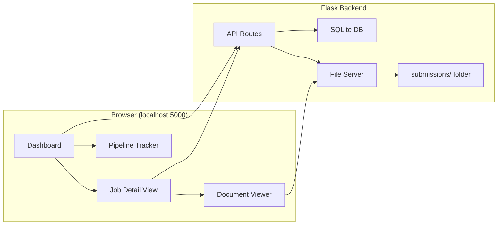

# JobAgent Command Center: Local App Experience

Replace the Google Drive + Google Sheets workflow with a self-contained local web app backed by SQLite.

## User Review Required

> [!IMPORTANT]
> **Tech stack decision**: I'm proposing **Flask** (Python) as the backend since your entire pipeline is already Python. This keeps you in a single language and avoids adding Node.js/npm to the project. The frontend is vanilla HTML/CSS/JS with the existing glassmorphism design language. **No external services, no cloud, no accounts needed.**

> [!IMPORTANT]
> **SQLite vs JSON**: SQLite gives you real querying, filtering, sorting, and timeline tracking that JSON can't. The `job_database.json` will be migrated into SQLite on first launch. The JSON file can still be exported/imported as a backup.

## Architecture Overview

**The app runs locally via `python app.py` and opens at `http://localhost:5000`.**

---

## Proposed Changes

### Database Layer

#### [NEW] app.db (SQLite Database)
Replaces `job_database.json` as the source of truth. Schema:

**`jobs` table:**
| Column | Type | Notes |
|---|---|---|
| `id` | INTEGER PRIMARY KEY | Auto-increment |
| `job_key` | TEXT UNIQUE | e.g. "Atlassian - Product Manager, DX" |
| `company` | TEXT | |
| `title` | TEXT | |
| `url` | TEXT | Application URL |
| `status` | TEXT | Drafted, Applied, Interviewing, Offered, Rejected, Archived |
| `score` | INTEGER | Fit engine score (0-100) |
| `folder_path` | TEXT | Path to submissions folder |
| `source` | TEXT | LinkedIn, Greenhouse, Ashby, etc. |
| `date_scouted` | DATE | |
| `date_applied` | DATE | |
| `date_rejected` | DATE | |
| `rejection_reason` | TEXT | |
| `fit_summary` | TEXT | |
| `notes` | TEXT | Free-form notes (replaces Google Sheets comments) |
| `created_at` | DATETIME | |
| `updated_at` | DATETIME | |

**`activity_log` table:**
| Column | Type | Notes |
|---|---|---|
| `id` | INTEGER PRIMARY KEY | |
| `job_id` | INTEGER FK | References jobs.id |
| `action` | TEXT | "Status changed", "Applied", "Interview scheduled", etc. |
| `details` | TEXT | "Drafted -> Applied" |
| `timestamp` | DATETIME | |

This replaces the Google Sheets "tracking" workflow.

---

### Backend (Flask)

#### [NEW] [app.py](file:///c:/Users/Jason/Desktop/Jason/Projects/AntiGravity%20Projects/JobAgent/app.py)
Main Flask application. Routes:

| Route | Method | Purpose |
|---|---|---|
| `/` | GET | Serves the dashboard SPA |
| `/api/jobs` | GET | List all jobs (with query params for status filter, search) |
| `/api/jobs/<id>` | GET | Single job detail + files list |
| `/api/jobs/<id>` | PATCH | Update status, notes, score |
| `/api/jobs/<id>/files` | GET | List generated files in the submission folder |
| `/api/jobs/<id>/files/<filename>` | GET | Serve a specific file (MD rendered as HTML, PDF as download) |
| `/api/stats` | GET | Pipeline summary (counts by status) |
| `/api/activity` | GET | Recent activity feed |
| `/api/export` | GET | Export database as JSON (backup) |

#### [NEW] [database.py](file:///c:/Users/Jason/Desktop/Jason/Projects/AntiGravity%20Projects/JobAgent/database.py)
SQLite connection manager, schema creation, and migration from `job_database.json`.

---

### Frontend (Single-Page App)

#### [MODIFY] [Job_Navigator.html](file:///c:/Users/Jason/Desktop/Jason/Projects/AntiGravity%20Projects/JobAgent/Job_Navigator.html) -> Becomes the app shell
The existing glassmorphism dashboard becomes the entry point for the full app. New views added:

**View 1: Pipeline Dashboard (current view, enhanced)**
- Stats bar (Active/Drafted/Applied/Interviewing counts)
- Job cards grouped by status
- Search + filter
- Quick status update via dropdown on each card
- **NEW**: Activity feed sidebar showing recent actions

**View 2: Job Detail Panel (click into a job card)**
- Full job info (company, title, URL, score, dates, notes)
- Editable notes field (replaces Google Sheets comments)
- Status change buttons with confirmation
- Timeline showing status history from `activity_log`
- **Document Gallery**: Grid of all generated files with preview

**View 3: Document Viewer (click a file)**
- Markdown files rendered as formatted HTML (using a lightweight MD parser)
- PDF files embedded via `<iframe>` or `<object>`  
- Plain text files displayed in a styled code block
- Download button for any file

**View 4: Analytics (optional, stretch)**
- Pipeline funnel visualization
- Application rate over time
- Rejection reason breakdown

---

### Pipeline Integration

#### [MODIFY] [scripts/utils.py](file:///c:/Users/Jason/Desktop/Jason/Projects/AntiGravity%20Projects/JobAgent/scripts/utils.py)
- Add functions to read/write from SQLite instead of JSON
- Keep JSON export as a backup mechanism

#### [MODIFY] [scripts/update_status.py](file:///c:/Users/Jason/Desktop/Jason/Projects/AntiGravity%20Projects/JobAgent/scripts/update_status.py)
- Update to write to SQLite + log to `activity_log` table

---

## Open Questions

> [!IMPORTANT]
> 1. **Do you want the app to auto-open in the browser** when you run `python app.py`? Or just print the URL?
> 2. **Notes field**: Should the notes support rich text (markdown), or is plain text enough?
> 3. **Google Sheets data**: Do you have existing tracking data in Google Sheets you want to import, or are we starting clean with what's in `job_database.json`?

---

## Verification Plan

### Automated Tests
- Verify SQLite migration: all 31 records from JSON appear in the DB with correct fields
- Verify all API routes return correct data
- Verify file serving works for MD, PDF, and TXT files

### Browser Tests
- Load dashboard, verify stats bar counts match database
- Click a job card, verify detail panel shows correct files
- Click a file, verify document viewer renders correctly
- Update a status, verify it persists and appears in activity log
- Search/filter, verify results are correct

### Manual Verification
- Confirm the experience replaces the need for Google Drive + Google Sheets
